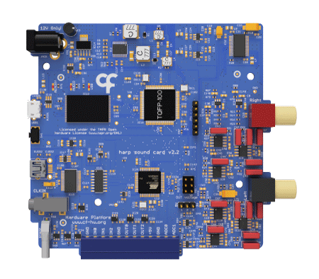
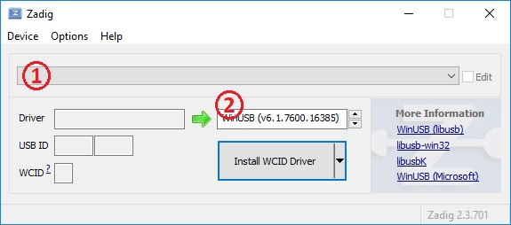

## Harp Soundcard
This is a high performance sound card with two output channels using 24 bits DACs at 192kHz sample rate. 

## Hardware Compatibility

|  HW Version 	| Board           	                                                | Board HW Version 	| Notes                            	|
|-----------------------	|-----------------	                                                |------------------	|----------------------------------	|
| **All**                 | [Peripheral.AudioAmp](https://github.com/harp-tech/peripheral.audioamp) 	| >= 2.0             |                                	|
----

## Firmware Compatibility

|  FW Version 	| Board           	                                                | Board HW Version 	| Notes                            	|
|-----------------------	|-----------------	                                                |------------------	|----------------------------------	|
| **>= 2.2**                 | [Device.SoundCard](https://github.com/harp-tech/device.soundcard) 	| >= 1.0             | Bpod serial communication not supported                                	|
| **<= 2.2**                 | [Device.SoundCard](https://github.com/harp-tech/device.soundcard) 	| >= 1.0             |                                	|
----

### Key Features ###

* Internal memory to store sounds, enabling low-latency sound delivery
* Pre-selected sounds can be triggered using an external TTL
* Internal wave generator allows the user to configure a pure tone without loading a sound file
* Stereo 24 bit @ 192 kHz maximum sampling rate outputs
* THD: -111dB (1 kHz @ 2 V rms)
* Noise Floor:	20 µV rms | -94 dB (20 Hz – 80 kHz)
* SNR:	100 dB | 113 dbA (20 Hz – 80 kHz @ 2 V rms)

### Connectivity ###

* 1x clock sync input (CLKIN) [stereo jack]
* 1x USB (for computer communication) [USB Mini-B]
* 1x micro USB (for sounds loading) [USB Micro-B]
* 1x 12V supply [barrel connector jack]
* 1x reset button [tactile switch]
* 1x output for the left channel [RCA]
* 1x output for the right channel [RCA]
* 3x general purpose digital outputs (3.3V or 5V) (OUT0-OUT2) [screw terminal]
* 3x general purpose digital inputs (5V tolerant) (IN0-IN2) [screw terminal]
* 2x analog inputs (3.3V máx - 5V tolerant) (ADC0-ADC1) [screw terminal]

## Interface ##

The interface with the Harp Soundcard can be done through [Bonsai](https://bonsai-rx.org/) or a dedicated GUI (Graphical User Interface).

### Install Graphical User Interface (GUI) ###

In order to use this GUI, there are some software that needs to be installed:

1 - Install the [drivers](https://bitbucket.org/fchampalimaud/downloads/downloads/UsbDriver-2.12.26.zip).

2 - Install the [runtime](https://bitbucket.org/fchampalimaud/downloads/downloads/Runtime-1.0.zip).

3 - Reboot the computer.

4 - Install the [GUI](https://bitbucket.org/fchampalimaud/downloads/downloads/Harp%20Sound%20Card%20v1.2.1.zip).

### Install Drivers ###

To install the proper drivers to interface with the device, follow the next steps in sequence.

1 - Connect both Harp Sound Card's USB ports to the computer.

2 - Launch the previously installed Harp Sound Card GUI.

3 - Click on the button Open Drivers folder and launch the zadig-2.3.exe.

4 - (1) Select the Harp Sound Card from the list. If the device is not available, go to Options -> List All Devices.

5 - (2) Select the WinUSB driver and click Install WCID Driver.

## Firmware ##

### Tagging Scheme ###

|Tag|Description|
|-|-|
|SoundCard-*|Firmware for the sound card's microcontroller (8 bits processor)|
|SoundCard.PIC32-*|Firmware for the sound card's 32 bits processor|

### Firmware Update ###

1 - Install the [Harp Converto to CSV](https://bitbucket.org/fchampalimaud/downloads/downloads/Harp_Convert_To_CSV_v1.8.3.zip).

2 - Open the Harp Convert to CSV application and write *bootloader* under List box on the Options tab

3 - Select the correspondent COM port and then select the firmware to be loaded for both microcontrollers 

# Licensing #

Each subdirectory will contain a license or, possibly, a set of licenses if it involves both hardware and software.

